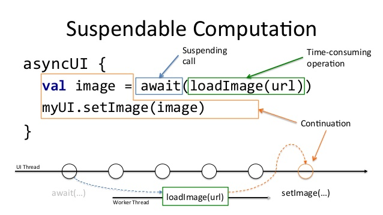

# Scout Manager

[](https://travis-ci.org/pablodeafsapps/scout-manager)


**Scout Manager** es una aplicación para la gestión de secciones de grupos scout de ASDE. El desarrollo software se inspira en la filosofía de diseño [*Clean Architecture*](https://blog.cleancoder.com/uncle-bob/2012/08/13/the-clean-architecture.html) y respetando en la medida de lo posible los [_Principios SOLID_](https://www.baeldung.com/solid-principles).


## Instalación
Clona este repositorio e impórtalo en **Android Studio**

##### SSH
```bash
> git clone git@github.com:pablodeafsapps/scout-manager.git
```

##### HTTPS
```bash
> git clone https://github.com/pablodeafsapps/scout-manager.git
```


## Generando un APK Firmado
Para la sincronización y compilación del proyecto es necesario que en la raíz del mismo se cree un fichero `keystore.properties` con el siguiente contenido:
```
storeFile=storeFile
storePassword=storePassword
keyAlias=keyAlias
keyPassword=keyPassword
```

Para generar un APK firmado será necesario modificar los valores del fichero con las credenciales del _keystore_ que se vaya a utilizar. Después y desde Android Studio:
1. ***Build*** menu
2. ***Generate Signed APK...***

Para subidas a producción (Google Play) el _keystore_ empleado deberá estar asociado a una cuenta de desarrollador de Google.


## Arquitectura y Organización

Para el desarrollo de **Scout Manager** se ha optado por emplear una jerarquía de clases basada en la idea de [**Clean Architecture**](https://blog.cleancoder.com/uncle-bob/2012/08/13/the-clean-architecture.html), concepto popularizado por Robert C. Martin (Uncle Bob).


### Jerarquía de Clases

Entre las distintas implementaciones del paradigma anterior para aplicaciones Android, destacan las aportaciones de [Antonio Leiva](https://antonioleiva.com/clean-architecture-android/) y [Fernando Cejas](https://fernandocejas.com/2014/09/03/architecting-android-the-clean-way/). Es precisamente el trabajo de este último el que ha servido de inspiración para la consecución de la presente aplicación.


Por tanto, la idea fundamental sobre la que se sustenta **Android Studio** es en la separación en capas de concreción. Cada una de estas entidades tiene asignadas ciertas responsabilidades, a las que les da respuesta de forma aislada. La interconexión entre dichas capas se hace a través de interfaces. Los tests a realizar serán casi exclusivamente de UI.

* **Presentation.**
Capa encargada de gestionar los eventos causados por las interacciones del usuario, así como de renderizar la información proveniente de la capa _domain_. En este caso se ha optado por emplear el patrón Model-View-ViewModel ([MVVM](https://proandroiddev.com/mvvm-architecture-viewmodel-and-livedata-part-1-604f50cda1)). Esta capa "ve" a la capa _domain_.

* **Domain.**
Entidad a cargo de la lógica de negocio de la aplicación. Consta de _use-cases_ (casos de uso) y de repositorios (_repository pattern_). La capa _domain_ obtiene los datos de _data_, realiza con ellos las operaciones necesarias y los prepara para su posterior envío a la capa de _presentation_. Esta entidad solo contiene código Kotlin, y por tanto es donde debe hacerse un uso intensivo de los test unitarios. Esta capa "ve" a la capa _data_.

* **Data.**
Capa que contiene librerías y frameworks que proporcionan datos a la aplicación (data sources). Entre ellos destacan las llamadas a servicios (_Retrofit_), bases de datos locales (_Room_), marcado de eventos (_Omniture_), etc. Esta capa es la más interior, y por tanto no ve a ninguna otra entidad.

El uso de esta jerarquía de clases y paquetes persigue la consecución de los principios SOLID, la flexibilidad a la hora de implementar nuevas funcionalidades, y la facilidad para testear el código.
 
### Inyección de Dependencias

Para facilitar la interacción entre las capas anteriormente descritas se usa la librería **[Koin](https://www.raywenderlich.com/9457-dependency-injection-with-koin)** (_service locator_, en realidad), que es un framework que permite abstraer la inyección de tipos de forma limpia y clara. 

### Coroutines

A fin de ofrecer una correcta gestión de los hilos de ejecución (_multithreading_), **Scout Manager** utliza [coroutines](https://codelabs.developers.google.com/codelabs/kotlin-coroutines/#0), que es una de las prestaciones más interesantes y potentes del lenguaje Kotlin.



Las ventajas que sustentan el uso de _coroutines_ son una fácil y mejorada gestión de los hilos de ejecución y la posibilidad de convertir operaciones asíncronas en síncronas sin menoscabo del rendimiento de la aplicación.

Desde el punto de vista del flujo de ejecución, todas las tareas se ejecutan en el hilo principal (UI thread) hasta que se invoca algún _use-case_. A partir de ese instante las operaciones se desarrollan en hilos secundarios, para después devolver el resultado computado en el hilo principal nuevamente.


## Licencia
La licencia de este proyecto se adhiere al estándar **GNU GENERAL PUBLIC LICENSE**. Constular el fichero *LICENSE.md* en la raíz del proyecto para más información. 


## Documentación
La gestión de la documentación tendrá dos vertientes:
* Usando este fichero **README.md** para documentar los aspectos teóricos y de configuración de este proyecto.
* Usando **dokka**, que es un framework para Kotlin similar a _Javadoc_.

Para el último punto, la documentación se ubicará en la ruta *docs/dokka*, y organizada por módulos. Para generarla, simplemente ejecuta lo siguiente desde el terminal:
```bash
> ./gradlew dokka
```  

Cuando finalice, abre el fichero `index.html` en tu navegador favorito.